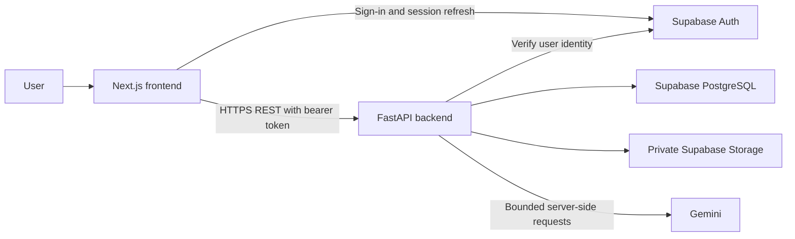

# Study Hub architecture

Study Hub preserves two separately runnable applications. Next.js owns the browser experience; FastAPI owns the authenticated application API and authoritative study logic. Supabase PostgreSQL is the structured-data source of truth, private Storage holds original resources, and Supabase Auth supplies identity.

## Frontend boundary

`frontend/` uses Next.js App Router, React, TypeScript, Tailwind CSS and the official Supabase JavaScript client. It owns routes, accessible UI/forms, presentation, browser state and FastAPI clients. Feature directories cover auth, dashboard, subjects, videos, study-plan, resources, quizzes, flashcards, assessments, focus, analytics and assistant. Shared components and the authenticated `(app)` layout preserve the shell across navigation.

The browser SDK handles email/password sign-in, local session persistence/refresh and sign-out only. Sessions live in browser local storage; the client page guard controls navigation, not data authorization. One shared auth provider verifies the initial identity through FastAPI and reuses identity for the same token. API clients send `Authorization: Bearer <access_token>`, recover a rejected session once, and retain retryable UI for temporary dependency failures. The browser does not query application tables or mutate Storage directly.

Only the Supabase project URL, current publishable key and FastAPI public URL belong in frontend variables. No database credentials, secret key or AI key crosses this boundary.

## Backend boundary

`backend/` uses FastAPI/Pydantic for HTTP validation, HTTPX for Auth/Storage/Gemini, SQLAlchemy/Psycopg for PostgreSQL and Alembic for explicit migrations. Thin `app/api` handlers delegate to `app/services`, `app/repositories`, `app/parsers` and `app/ai`; `app/schemas` holds DTOs, `app/core` holds settings/auth and `app/db` holds connection infrastructure. No application startup schema creation or migration occurs.

Protected routes validate the bearer token with Supabase `/auth/v1/user`; the verified UUID supplies ownership. Invalid sessions return 401; unavailable dependencies return sanitized errors. Repositories explicitly scope private records to that identity because privileged backend access is not constrained by browser RLS. PostgreSQL RLS/grants additionally protect direct authenticated access. Public `/health` tests process availability only.

The backend owns curriculum validation, lecture progress, planner recurrence, actual session duration, resource parsing, CSV normalization, quiz scoring, versioned recall scheduling, assessment percentages and analytics calculations. The frontend renders those results. [API.md](API.md), [DATABASE.md](DATABASE.md) and [DATA_AND_TELEMETRY.md](DATA_AND_TELEMETRY.md) define detailed contracts.

## Domain modules and persistence

| Domain | Authoritative behavior |
| --- | --- |
| Curriculum and videos | Stable subject/topic/video identities; private lecture completion; known and unknown durations kept distinct. |
| Dashboard and planner | Owner-scoped summaries, recurrence expansion and occurrence snapshots; tasks and one active study session per account. Planned time stays separate from actual time. |
| Resources | Owned PDF/CSV metadata, private originals and ordered PDF sections; parsing is synchronous and bounded. |
| Quizzes | Questions/options, ordered quizzes, frozen attempt snapshots and saved answers. Submission grades server-side; completed scores survive later bank edits. |
| Flashcards and recall | Private decks/cards, immutable review history and transactional `recall-v1` scheduling with revision/request safeguards. |
| Assessments | Exact topic or explicit whole-subject coverage, manual results and independent preparation indicators; archive retains history. |
| Focus and analytics | Persisted server timestamps; finished-session time clipped/split by profile-local dates; recurrence-aware planned totals. |
| AI assistance | Owned source resolution, bounded Gemini calls, validated transient drafts and explicit-save provenance. |

Current migrations end at `0010_ai_provenance`. Version-controlled migrations include constraints, owner relationships, RLS and grants. Google Sheets/XLSX and CSV are input sources, not a second production database. Reviewed workbook import tools are local, dry-run-first and insert-only; they preserve source metadata and reject conflicts instead of overwriting user data. See [IMPORTS.md](IMPORTS.md).

## Resource service boundary

FastAPI checks the multipart envelope and 4 MiB file cap, validates CSV before writing, stores originals in private `study-resources`, and stores resource metadata/page text in PostgreSQL. Object paths are backend-controlled. Download access uses a freshly authorized 120-second signed URL.

Storage and PostgreSQL cannot share a transaction. Upload failures compensate newly created objects; deletion retains metadata if Storage removal fails. Processing status commits synchronously rather than representing a durable background queue. PDF text and paginated responses are bounded; no OCR or general background worker is implemented. A future worker belongs behind the existing processing service if supported workload requires one.

## AI service boundary

`app/ai` contains provider, retrieval, prompts, limits and draft-receipt logic. FastAPI resolves owned ready PDF passages or completed quiz snapshots before Gemini calls. Topic-only help is explicitly identified as AI knowledge. Fixed system instructions are separate from untrusted study material; quotes and page citations are validated against supplied passages.

No model output automatically persists or controls study history. Ask/explain remain transient. Explicit question/card saves reuse existing domain APIs and verify owner-bound draft receipts. AI cards save suspended. Nullable provenance records the original provider/model/source context, not a guarantee about later user edits. Receipt signing derives a purpose-separated key from the existing backend secret; no extra environment key is required.

Provider requests have size/output/time caps and no automatic retries. Process-local limits are not a distributed budget; production requires provider quota controls. There are no embeddings, vector database, chat-history tables, AI workers or frontend provider calls. See [AI.md](AI.md) and [the AI contract](docs/phase-12-ai-study.md).

## Hosting and operations

The supported deployment plan uses separate Vercel projects rooted at `frontend/` and `backend/`, with separate environment variables/builds/logs. The backend pins Python 3.13 in `.python-version`. Supabase supplies database/Auth/Storage. Frontend public variables are build-time configuration; backend CORS lists exact trusted frontend origins. Schema and bucket setup run explicitly before relying on dependent features.

No production project link or URL is recorded. Deployment steps are in [DEPLOYMENT.md](DEPLOYMENT.md); operating responsibilities, recovery considerations and known limits are in [docs/HANDOFF.md](docs/HANDOFF.md).
