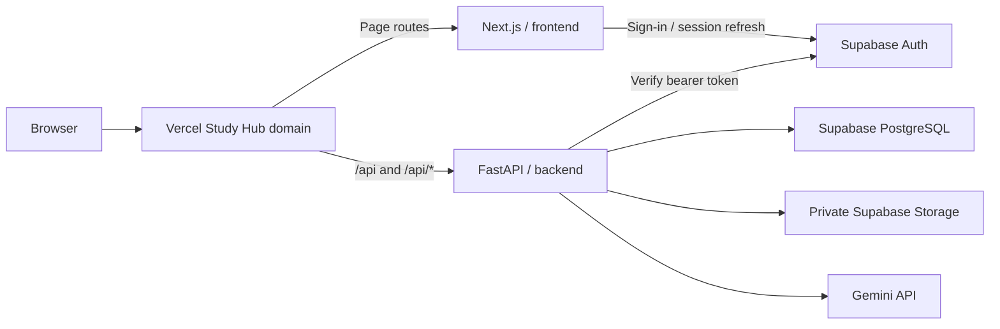

# Deployment

Study Hub deploys as **one Vercel project rooted at the repository root**.
The root `vercel.json` uses the current `services` configuration: independently
built Next.js and FastAPI applications share one deployment and public domain.
Do not set the project Root Directory to `frontend` or `backend`.



## Service configuration

- `frontend`: root `frontend/`, framework `nextjs`.
- `backend`: root `backend/`, framework `fastapi`, entrypoint `app.main:app`.
- Ordered root rewrites send `/api` and `/api/:path*` to the backend, preserving
  the request path. All other routes go to Next.js.
- Public health endpoint: `/api/health`. Local `/health` remains available.
- No catch-all Next.js proxy, legacy `builds`, or `experimentalServices` is used.
- Services share project environment variables. Only `NEXT_PUBLIC_*` settings
  may enter browser bundles; server credentials remain backend-only in code.

See [Vercel Services](https://vercel.com/docs/services),
[service configuration](https://vercel.com/docs/services/config-reference),
and [routing](https://vercel.com/docs/services/routing).

## Environment checklist

Configure the following in the linked Vercel project's **Production** environment.
Enter actual values through the owner's Vercel dashboard or CLI prompts; never
put them in Git, examples, commands, reports or logs.

| Variable | Required production configuration |
| --- | --- |
| `NEXT_PUBLIC_SUPABASE_URL` | Existing Supabase project URL |
| `NEXT_PUBLIC_SUPABASE_PUBLISHABLE_KEY` | Current publishable key from that project |
| `NEXT_PUBLIC_API_URL` | Leave unset/empty for same-origin `/api/*` requests |
| `SUPABASE_URL` | Same existing Supabase project URL |
| `SUPABASE_SECRET_KEY` | Current server-only Supabase secret key |
| `DATABASE_URL` | TLS-enabled PostgreSQL connection string; encode password characters |
| `GEMINI_API_KEY` | Server-only Gemini provider key |
| `GEMINI_MODEL` | Explicit accessible Gemini model supporting structured JSON output |
| `CORS_ORIGINS` | Empty for same-origin-only production, or exact deployed frontend origin |

Do not set production `NEXT_PUBLIC_API_URL` to localhost. Public configuration
is baked into the Next.js build and requires redeployment after changes.
A current Supabase secret key is an `apikey`, not a bearer JWT. Study Hub API
requests still authenticate using the user's Supabase bearer token.

`.vercelignore` excludes local credentials, virtual environments, caches,
private data/imports, verification scripts and tests from CLI uploads. Git
also ignores local environment files and the private workbook. Never use
`vercel env pull` into a tracked file.

## Local development

Keep separately runnable applications and existing Git-ignored configuration:

```dotenv
# frontend/.env.local
NEXT_PUBLIC_API_URL=http://localhost:8001

# backend/.env
CORS_ORIGINS=http://localhost:3000,http://localhost:3001
```

Run from separate PowerShell terminals:

```powershell
cd frontend
npm.cmd ci
npm.cmd run dev -- --port 3001
```

```powershell
cd backend
.\.venv\Scripts\python.exe -m uvicorn app.main:app --reload --port 8001
```

Port 8000 belongs to the separate F1 project. CORS splits comma-separated
origins, trims whitespace, and rejects wildcards. Local CORS is not changed
when production environment variables are configured.

## Verify existing Supabase services

Deployment never creates a replacement Supabase project, runs migrations on
startup, or imports the personal workbook. Review migration state from `backend/`:

```powershell
.\.venv\Scripts\python.exe -m alembic current
```

Current head is `0010_ai_provenance`. Apply only reviewed pending additive
migrations using `python -m alembic upgrade head`; never reset, truncate or
run destructive downgrades. Use direct/session-pooler connectivity for migrations.
An appropriate transaction-pooler connection with TLS is suitable for the runtime;
SQLAlchemy uses `NullPool` and Psycopg prepared statements are disabled.

The existing private `study-resources` bucket must retain its 4 MiB file cap,
PDF/CSV MIME restrictions and owner/path policies. Review existing setup before
running `python -m app.services.resource_storage`, which creates/verifies the
bucket and rejects public/incompatible configuration. No browser mutation
policies are broadened for deployment.

After a real production domain is known, the owner should configure Supabase
Auth Site URL and necessary redirect allowlist entries to that actual domain.
Email/password sign-in is enabled; account provisioning remains owner-managed.

## Link and deploy

Install the official CLI and authenticate as the intended owner:

```powershell
npm.cmd install --global vercel
vercel.cmd login
vercel.cmd whoami
```

From the **repository root**, inspect existing projects under the intended team
before linking. Reuse an appropriate Study Hub project instead of creating a
duplicate. Use `vercel.cmd link` and select the actual account/project. A new
project is authorized only if none exists; do not authorize billing or paid
resources without owner action. Link metadata stays in ignored `.vercel/`.
Connect the existing GitHub repository with repository-root builds.

Set Production variables in the Vercel dashboard. The owner can alternatively
run `vercel.cmd env add VARIABLE_NAME production` and enter values privately.
Do not pull secrets into source control or send them through command arguments.
Configure Preview separately; do not give arbitrary previews production data.

Then deploy from the repository root:

```powershell
vercel.cmd --prod
```

Inspect build/runtime logs for sanitized errors. Preserve user-owned uncommitted
UI work: deployment commits include only reviewed deployment changes. For a
reproducible main-branch deployment, use current main plus the deployment patch
in an isolated checkout rather than publishing unreviewed UI changes.

## Production verification

Once an actual URL exists, verify `/`, `/login` and `/api/health` publicly.
`/api/auth/me` must reject an unauthenticated request with 401. From an authorized
client account verify sign-in/session restore, authenticated identity, Dashboard,
Subjects/Videos, Study Plan, Library, Quizzes, Flashcards/Recall, Assessments,
Focus, Analytics and Assistant. Keep owner/resource isolation and explicit AI
save confirmation intact. Never delete client data as a smoke test.

Production same-origin requests need no permissive CORS. If an explicit origin
is configured, verify OPTIONS allows it and rejects unrelated origins. Project
Deployment Protection applies across services; owner action is required if it
prevents intended client access. Do not weaken Study Hub bearer authorization.

## Runtime boundaries and troubleshooting

Python 3.13 is pinned in `backend/.python-version`; local Uvicorn remains unchanged.
FastAPI imports `app.main:app`. Uploads and parsing use bounded memory and private
Supabase Storage, without local persistent file requirements. PDF/CSV file content
is capped at 4 MiB with a bounded multipart envelope, below Vercel's 4.5 MB
request ceiling. Content responses are paginated. Signed URLs expire after
120 seconds; never log them. See [function limits](https://vercel.com/docs/functions/limitations).

PDF extraction is synchronous; OCR/background jobs are not implemented. AI
requests have bounded context/output, a 30-second provider deadline and no
automatic retries. Process-local limits do not coordinate serverless instances;
provider quotas/budgets remain owner responsibilities. Backend-only credentials
must never have a `NEXT_PUBLIC_` prefix.

| Symptom | Check |
| --- | --- |
| API returns a Next.js page/404 | Project root and ordered service rewrites; no stripped `/api` prefix |
| Browser calls localhost in production | Remove production `NEXT_PUBLIC_API_URL`, then rebuild |
| Protected API returns 503 | Server environment configuration and existing Supabase connectivity |
| Vercel login/protection page appears | Owner CLI login or project Deployment Protection settings |
| Upload fails | Private bucket, supported type, 4 MiB cap and multipart envelope |
| AI unavailable | Both backend Gemini variables, model access and provider quota |

Maintain separate PostgreSQL and Storage-original backups. See
[docs/HANDOFF.md](docs/HANDOFF.md) for owner responsibilities and feature limits.

## Current deployment status

Production: [study-hub-theta-ashy.vercel.app](https://study-hub-theta-ashy.vercel.app).
The linked Hobby-plan project is `earls-projects-4247e9fe/study-hub`, rooted at
this repository. CLI deployment completed with Next.js compilation/TypeScript
checks and the Python 3.13 FastAPI service build passing.

Seven Production variables are configured: the two public Supabase settings
and five backend Supabase/database/Gemini settings. `NEXT_PUBLIC_API_URL` remains
unset; `CORS_ORIGINS` remains unset for same-origin-only requests.

Live verification on 2026-10-10 confirmed:

- Fifteen top-level page routes returned HTML successfully; 25 browser JS/CSS
  assets loaded. Compiled public Supabase configuration matched the Auth project.
- `/api/health` returned `{"status":"ok"}`; unauthenticated `/api/auth/me`
  returned 401, and an unknown API route returned FastAPI JSON 404.
- A temporary Supabase user signed in, called production `/api/auth/me`, refreshed
  the session and called it again; sign-out revoked refresh access.
- Authenticated Dashboard, Subjects, Planner tasks, Resources, Question Bank,
  Quizzes, Flashcards/Recall, Assessments, Focus and Analytics reads returned 200.
  All seven shared subject codes were present.
- Synthetic PDF/CSV uploads, text extraction/CSV preview, expiring private
  downloads and cross-user denial passed through the deployed backend.
- Live Gemini resource Q&A returned a grounded answer with valid resource/page
  citations. The first request returned a sanitized 503; a manual recheck passed
  in 11.8 seconds without changing provider logic or its existing limits.
- All temporary verification users, resource metadata, sections and uploaded
  Storage objects were removed; no client study records were changed.
- Browser assets contained no tested server secrets or localhost API origin;
  an unrelated-origin preflight was rejected. Runtime error-log inspection found
  no error entries during these checks.

Browser interaction could not be automated because no browser was connected.
Owner acceptance checklist: open the production URL, sign in, reload to confirm
session restoration, navigate the implemented pages, then sign out and confirm
protected access redirects to login. Configure Supabase Auth Site URL and any
required redirect allowlist entries to this production origin if not already
configured; email/password API sign-in itself passed. The existing uncommitted
UI review changes remain local and are excluded from this main-branch deployment.
