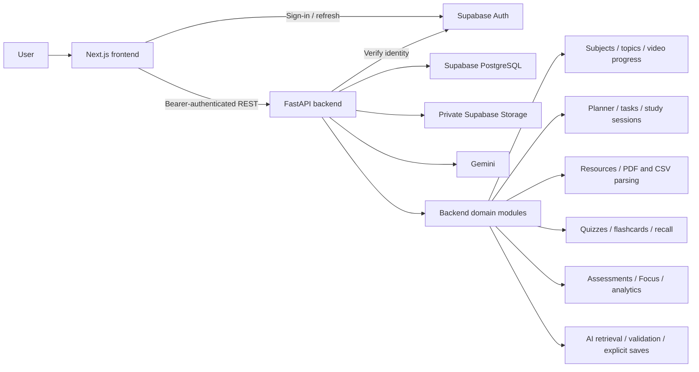

# Study Hub handoff

Study Hub provides the implemented study workspace described in [README.md](../README.md). The frontend and backend remain independent applications; Supabase is the persistent source of identity, structured records and private files. This document records ownership and operating limits for the current implementation, with migrations through **`0010_ai_provenance`**.

Production runs at [study-hub-theta-ashy.vercel.app](https://study-hub-theta-ashy.vercel.app) in the linked `earls-projects-4247e9fe/study-hub` Vercel project. Next.js pages and FastAPI `/api/*` routes share that domain. See [DEPLOYMENT.md](../DEPLOYMENT.md) for live verification results and the remaining owner browser checklist.

## Responsibilities and service boundary



| Area | Responsibility |
| --- | --- |
| Project owner/operator | Supabase/Vercel/provider account access, confirmed-user provisioning, environment secrets, reviewed migrations, private bucket setup, backups, quota controls and production verification. |
| Frontend maintainers | Next.js routes, React UI, accessibility, browser session UX, public configuration and calls to FastAPI. |
| Backend maintainers | Auth enforcement/ownership, validation, repositories, migrations, imports/parsers, scoring/scheduling/time calculations and Gemini integration. |
| Supabase | Auth identity/session services, PostgreSQL records and Storage object hosting. The backend still validates ownership before privileged access. |
| Gemini | Optional generation/explanations from bounded input. It cannot control deterministic scores, progress, reviews, schedules or security. |

See [ARCHITECTURE.md](../ARCHITECTURE.md) for implementation details. The browser accesses Supabase Auth directly; application records and file operations go through FastAPI.

## Environment inventory

Configure the same Supabase project on both applications. Real values belong in ignored local environment files or hosting secret settings. Tracked examples contain placeholders only.

| Frontend variable (`frontend/.env.local`) | Value/purpose |
| --- | --- |
| `NEXT_PUBLIC_API_URL` | `http://localhost:8001` locally; unset/empty in production for same-origin `/api/*`. |
| `NEXT_PUBLIC_SUPABASE_URL` | Actual Supabase project URL. |
| `NEXT_PUBLIC_SUPABASE_PUBLISHABLE_KEY` | Current `sb_publishable_...` key; public browser Auth configuration. |

| Backend variable (`backend/.env`) | Value/purpose |
| --- | --- |
| `SUPABASE_URL` | Same actual Supabase project URL. |
| `SUPABASE_SECRET_KEY` | Current `sb_secret_...` key; backend-only Auth/Storage operations and derived AI draft signing. |
| `DATABASE_URL` | PostgreSQL connection URL; backend-only, URL-encoded password and TLS for hosted connections. |
| `GEMINI_API_KEY` | Backend-only provider credential; required for live AI. |
| `GEMINI_MODEL` | Explicit supported `gemini-...` model identifier; required for live AI. |
| `CORS_ORIGINS` | Exact trusted frontend origins, comma-separated; locally `http://localhost:3000,http://localhost:3001`. |

There are **two required public production variables**, an optional/local API-origin override, and six backend application variables in one Vercel Services project. No separate AI signing secret is required. Legacy anon/service-role variable names are not used. Missing Gemini settings disable AI with sanitized errors. Missing Supabase/database settings leave `/health` available but do not make protected features usable. Restart backend processes after changes; rebuild/redeploy the frontend for production public-variable changes.

Use frontend **3001** and backend **8001** locally. **8000 is reserved for the separate F1 project; do not stop, start or reconfigure it.** Windows commands and prerequisites are in [README.md](../README.md).

## Database and Storage maintenance

Review the intended project, connection privileges, backup position and migration changes before upgrades. The migration connection needs access to Supabase Auth objects/roles; use a suitable direct or session-pooler connection rather than assuming a plain PostgreSQL instance is sufficient.

From `backend/`, with its existing virtual environment and configured environment:

```powershell
.\.venv\Scripts\python.exe -m alembic history
.\.venv\Scripts\python.exe -m alembic upgrade head
.\.venv\Scripts\python.exe -m alembic current
.\.venv\Scripts\python.exe -m app.services.resource_storage
```

Expected current head: `0010_ai_provenance`. Application startup never migrates. For review without applying schema changes, `alembic upgrade head --sql` generates SQL; it does not prove correctness on a live database. Future changes require a reviewed hand-authored migration (`alembic revision -m "description"`); do not use schema resets or destructive downgrade as routine rollback. Consult [DATABASE.md](../DATABASE.md) and [DEPLOYMENT.md](../DEPLOYMENT.md).

The `study-resources` bucket must be private, restricted to PDF/CSV and configured for **4 MiB (4,194,304 bytes)** files. The setup command verifies existing configuration and fails on incompatibility. The migration includes owner-path/matching-metadata read policies and no browser mutation policies. FastAPI authorizes downloads and issues **120-second** links. Do not persist or log signed URLs.

Migrations seed seven subjects and create/backfill profiles. Curriculum/videos and owner-specific assessments require separate reviewed imports; migration execution does not replay local workbooks or personal history. Default profile timezone is `Asia/Manila`. Account creation is owner-managed in Supabase; users must be confirmed/enabled. Public sign-up/password-reset UI is absent.

## Backup and restore considerations

The owner must select and maintain a backup/retention plan appropriate to the actual Supabase subscription. Supabase database backups include Storage metadata but **do not include original Storage object bytes**; restoring an old database backup cannot recover a subsequently deleted file. Keep a separate protected backup of private originals with their paths and corresponding database backup point. [Supabase database backup documentation](https://supabase.com/docs/guides/platform/backups).

Maintain a secure configuration inventory separately from Git: environment values, account ownership, bucket restrictions and provider settings. Restoring to a new Supabase project also requires separate Storage/configuration work; project cloning does not copy Storage objects/settings. [Supabase restore-to-new-project documentation](https://supabase.com/docs/guides/platform/clone-project).

Rehearse restoration into an isolated target before relying on it. Check migration version, Auth/profile relationships, owner isolation/RLS, resource metadata-to-object correspondence, PDF sections, quiz snapshots, recall history, assessment history and session totals. Reconfigure actual project URLs/keys, private bucket and CORS, then redeploy public frontend configuration and verify sign-in/downloads. No backup automation or restore drill is claimed by this handoff; production deletion/reset/restore requires explicit owner authorization.

## Operating limits and deferred features

| Area | Current boundary |
| --- | --- |
| Auth | Email/password sign-in only; no public registration or password-reset UI. Session guards are client-side; FastAPI remains the authorization authority. |
| Planner | Month/week grids and mobile agenda; reschedule in the editor. Drag-and-drop, a separate Day grid and workbook schedule import are deferred. |
| Videos/progress | Lecture tracking, no video player. Known lecture duration is not measured study time or overall mastery. |
| Resources | Text-based PDF/CSV only, 4 MiB files, synchronous bounded extraction and paginated text. OCR/scanned-text recovery, DOCX/XLSX/image uploads and worker processing are deferred. |
| Quizzes | Single-select, multi-select and true/false; multi-select exact-set grading. No free-response grading. Question CSV uses the reviewed UTF-8 template, at most 1 MiB/500 rows, with preview/confirmation. |
| Flashcards/recall | Manual/quiz-mistake/AI cards and server-owned `recall-v1`. Flashcard CSV import and transfer of source workbook R1–R5 history are deferred. |
| Focus/analytics | One persisted active session, start/finish; pause is deferred. Actual metrics use finished sessions only. No invented readiness/mastery/adherence score. |
| AI | Selected passages, curriculum context or completed own quiz snapshots; no embeddings, chat history, OCR, provider tools or background AI queue. Topic-only help is labelled AI knowledge. Drafts need explicit save; cards remain suspended until activated. |

AI caps include 2,000 prompt characters, 32 KiB request bodies, six passages/12,000 context characters, at most five generated questions or ten cards, 4,096 output tokens, a 30-second provider deadline and no automatic retries. Per user: one generation in flight, five requests/minute and 100/day; eight provider calls concurrently per process. These process-local limits reset on restart and are not distributed. Provider quota/billing controls remain the production cost boundary. See [AI.md](../AI.md) and [the AI implementation contract](phase-12-ai-study.md).

The prior Phase 12 live verification used five bounded synthetic Gemini calls. This verifies those responses with the configured provider, not production quotas, ongoing model quality or deployed operation. The final readiness pass uses mocked-provider security/contract checks without repeating paid generation. No credentials or real document contents belong in reports.

## Source data decisions and evidence

Imports normalize before persistence, require preview/explicit approval and preserve unresolved source decisions. Original workbooks and generated JSON manifests stay local/ignored. Safe Markdown reports describe content mapping without owner credentials or personal history. Follow [IMPORTS.md](../IMPORTS.md) when repeating imports; early phase paragraphs there are historical and later implementation reports define what was actually imported.

| Source area | Reviewed result / unresolved decision |
| --- | --- |
| Curriculum | 163 topics imported; rerun zero inserts. FAR-19/FAR-36 lacked usable titles and were excluded. All topics remain flat because source data did not establish parent relationships. [Curriculum report](../data/imports/reports/project-1-second-dry-run.md). |
| Videos | 1,562 imported; rerun zero inserts. FAR Vids rows 586–587 remain excluded duplicate-title/different-duration conflicts. Reviewed RFBT alias/duration handling is documented rather than guessed. [Video report](../data/imports/reports/project-1-video-second-dry-run.md). |
| Schedule/Calendar | Report-only: no exact study times or confirmed owner, plus ambiguous/cross-subject references. Zero event/task/session writes. [Schedule report](../data/imports/reports/project-1-schedule-dry-run.md). |
| Recall | 155/156 references match exactly; the AP title remains unresolved. Zero cards/reviews/history transferred; spreadsheet repetition columns are not a scheduling algorithm. [Recall proposal](../data/imports/reports/project-1-recall-proposal.md). |
| Assessments | Five definitions, 71 topic links and one explicit whole-AP link imported for the selected owner. 74 unmatched labels remain excluded with partial-coverage notices; zero dates/results/history imported. Rerun zero inserts/five unchanged. [Assessment report](../data/imports/reports/project-1-assessment-second-dry-run.md), [implementation record](phase-10-assessments.md). |

These reports describe the reviewed import target at that time, not a guarantee that another Supabase project has the same records. Do not fill gaps with fabricated titles, dates, ownership, results or history.

## Release verification and follow-up

Use the production checklist in [DEPLOYMENT.md](../DEPLOYMENT.md) after actual projects/environment values are configured. Verify the existing sign-in/session, planner, resources, quiz/recall, assessments, Focus/analytics and AI flows with designated test data. Inspect logs for sanitized failures without collecting credentials, signed links or private content. Existing live verification scripts may create temporary users/records; review their scope and target before invoking them.

The [production readiness record](PRODUCTION_QA.md) separates completed checks from pending browser/production acceptance. Detailed implementation/verification evidence remains in feature documents and safe import reports. Local checks do not establish production hosting, external backup readiness or distributed AI budgets. All later capability changes follow [AGENTS.md](../AGENTS.md) and product/design/API/database contracts; this handoff adds no new feature scope.
